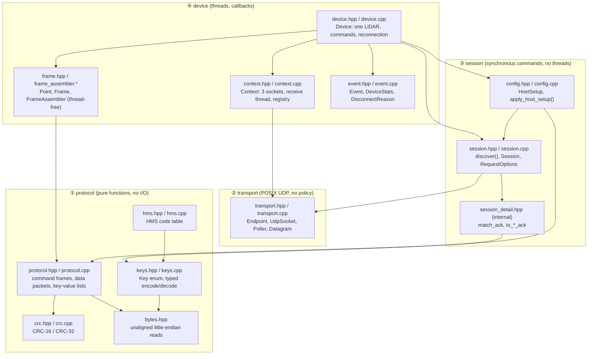
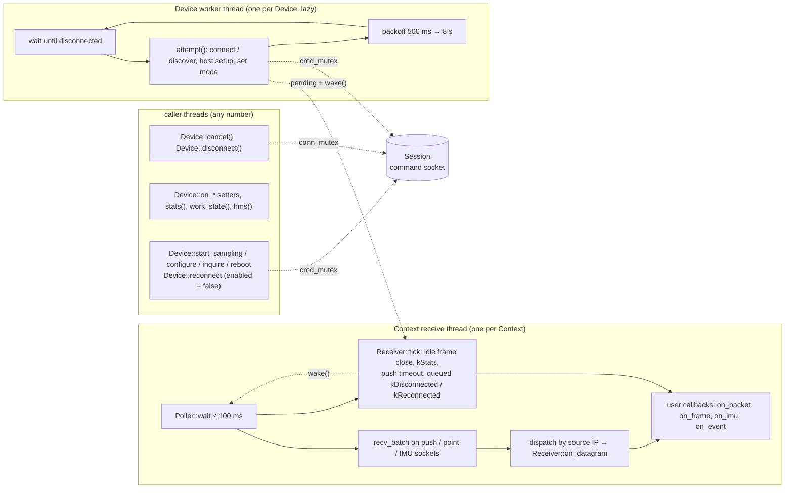
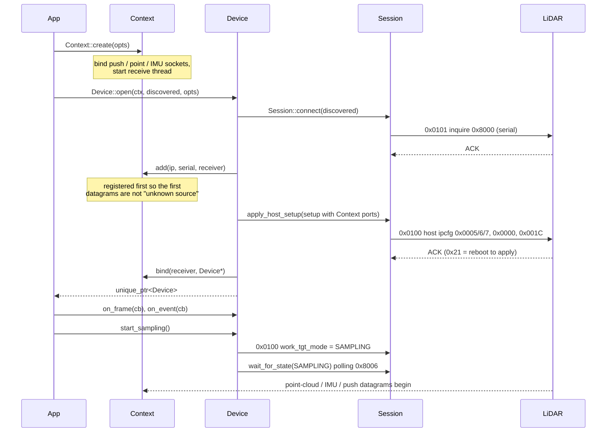
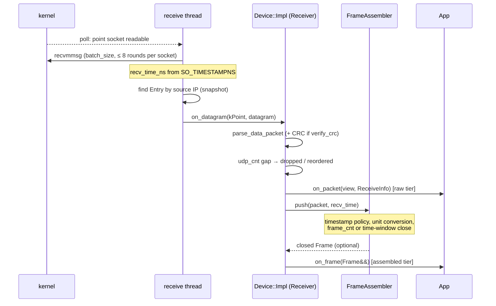
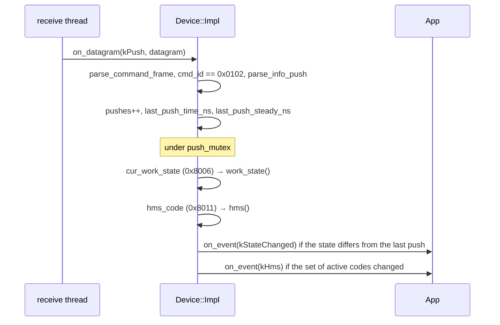
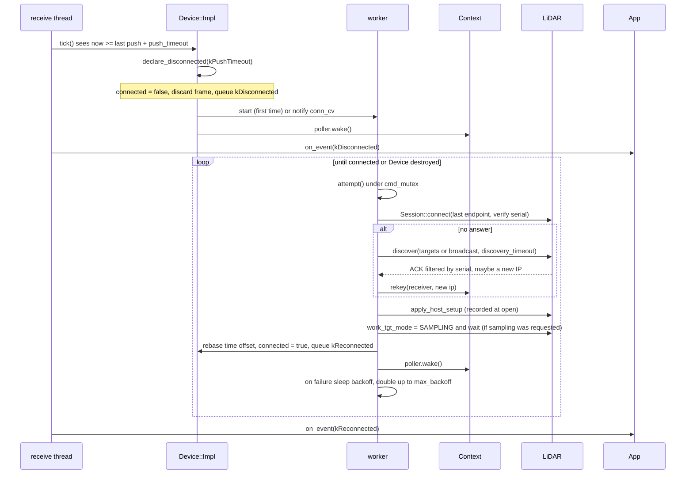
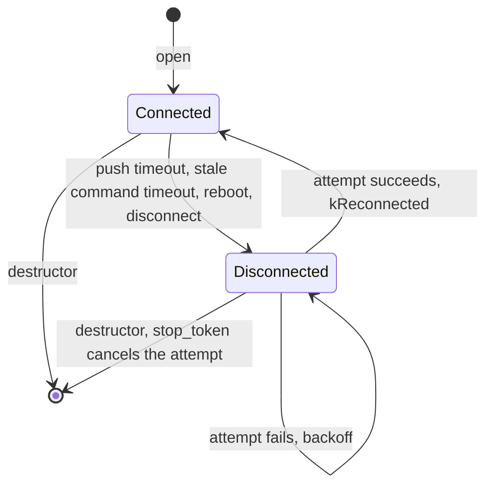
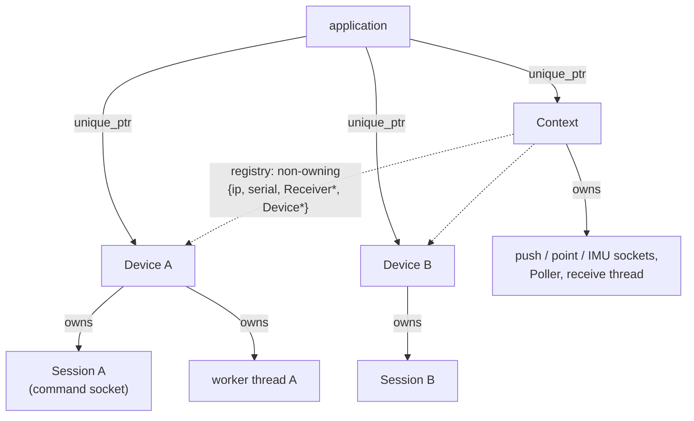
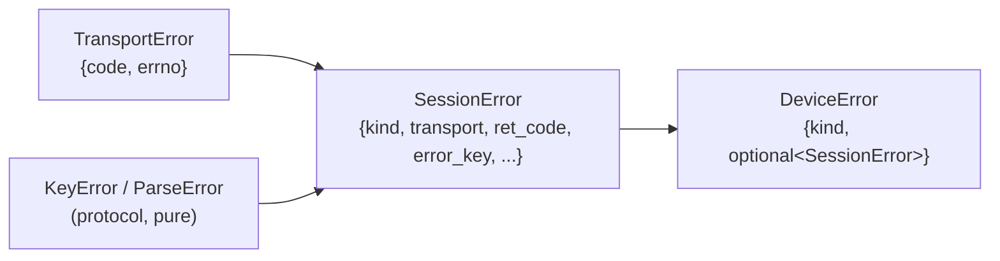
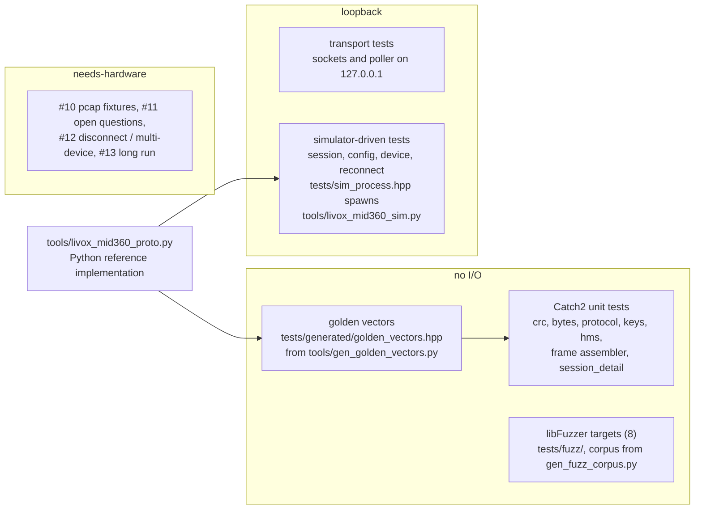

# Architecture

How the layers of `livox-mid360-core` fit together: modules and their allowed dependencies,
the threads and locks, the path of a datagram to a user callback, ownership rules, the error
model and how all of it is tested. The per-layer pages hold the detail; this page is the map.

| Layer | Page | Design issue |
| --- | --- | --- |
| ④ device: `Context`, `Device`, frames, events | [api.md](api.md) | #6, #7, #8, #9 |
| ③ session: `discover()`, `Session`, `HostSetup` | [session.md](session.md) | #4, #5 |
| ② transport: `UdpSocket`, `Poller` | [transport.md](transport.md) | #2 |
| ① protocol: CRC, frames, packets, keys, HMS | [protocol_notes.md](protocol_notes.md) | — |
| test double: `tools/livox_mid360_sim.py` | [simulator.md](simulator.md) | #3 |

Last verified against commit `e429f5e` (2026-09-26). When the code moves, update the
diagrams here first and the per-layer pages second.

## 1. Layers and modules

Rules the arrows encode (enforced by review, not by tooling):

- **Dependencies point down only.** Layer ① never includes anything above it; layer ② knows
  nothing about the Mid-360 protocol; layer ③ creates no threads; layer ④ is the only place
  where threads, callbacks and timers exist.
- **`export.hpp`** is included by every public header for the shared-library visibility
  macros and is not part of the graph. `mid360.hpp` is an umbrella that includes everything.
- **Internal headers** (`context_impl.hpp`, `session_detail.hpp`, `frame_assembler.hpp`) are
  not installed. `session_detail.hpp` and `frame_assembler.hpp` export their symbols anyway
  so the fuzzers and tests can link against them; they are not a stable API.
- **The receive thread only sees `detail::Receiver`** (`context_impl.hpp`): two virtual
  methods, `on_datagram(port, datagram)` and `tick(now)`. `Device::Impl` implements it.
  `Context` never includes `device.hpp` beyond the forward declaration it needs for
  `find()`.

## 2. Threads and locks

### Threads

| Thread | Created by | Runs | Must not |
| --- | --- | --- | --- |
| receive thread | `Context::create` | `Context::Impl::run()`: poll, drain, dispatch, timers, **every user callback** | block; call a command; destroy a Device |
| worker | `Device::Impl::declare_disconnected` (first disconnect, `reconnect.enabled`) | `run_worker()`: `attempt()` with exponential backoff until connected or stopped | touch the Context after `remove()` (the destructor joins it first) |
| caller threads | the application | all commands (synchronous, on the caller's thread), setters, observation methods | call commands from a callback (asserted in debug builds) |

`Session` is single-threaded by design: it drives its own `Poller::wait()` on the caller's
thread. `Device` serialises access to it.

### Locks in `Device::Impl`

| Mutex | Protects | Held by |
| --- | --- | --- |
| `cmd_mutex` | the command path: one command or one `attempt()` at a time | commands, `attempt()` (worker and `reconnect()`) |
| `conn_mutex` | `info_`, `session` swap, `pending` events, worker hand-off, `cancel()` | short critical sections everywhere; `run_worker()` sleeps on `conn_cv` with it |
| `push_mutex` | pushed work state and HMS set (`work_state()`, `hms()`) | receive thread (write), observers (read) |
| `cb_mutex` | the four callback slots plus `cb_generation` | setters (write), receive thread (copy when the generation changes) |

Lock order when two are needed: **`cmd_mutex` → `conn_mutex`**. `push_mutex` and `cb_mutex`
are leaf locks (never held while taking another). The receive thread takes only leaf locks
and `conn_mutex` for a swap of the `pending` vector, so a slow command can never stall
reception. `Context::Impl::mutex` guards the registry and is likewise never held while calling
into a Device.

Counters (`DeviceStats`, `ContextStats`) are relaxed atomics written by one thread each;
`stats()` is a lock-free snapshot. Connection state is `std::atomic<bool> connected`, changed
with a compare-exchange so that a disconnect is declared exactly once per outage.

### Callback contract

- Callbacks run on the receive thread with no Device lock held; they may take the
  application's own locks and call `stats()`, `work_state()`, `hms()`, `connected()`.
- They may not call a command (`assert(!on_receive_thread())`), `reconnect()`, or destroy
  the Device or Context.
- The receive thread copies the callback slots when `cb_generation` changes (at the next
  datagram or tick), so a setter returns before the old callback is guaranteed idle; setters
  are refused while sampling is requested (`kInvalidState`), which is what makes the copy
  race-free in practice.
- An exception escaping a callback terminates the process.

## 3. Data and control flows

### 3.1 Open, host setup, start sampling

Failure anywhere in `open()` unwinds: a host-setup error removes the registry entry again and
returns the wrapped `SessionError`.

### 3.2 A point-cloud datagram to `on_frame`

IMU packets take the same path with `on_imu` at the end and no assembler. An unknown source
IP increments `ContextStats::unknown_source` and the datagram is dropped before any parsing.
The idle close of a partial frame and the periodic `kStats` event come from `tick()`, not from
a datagram.

### 3.3 A push to `kStateChanged` / `kHms`

The push is also the heartbeat: `last_push_steady_ns` feeds the push-timeout check below.

### 3.4 Outage, reconnection and replay

The same `attempt()` runs on the caller's thread for `Device::reconnect()` when automatic
recovery is disabled. The other disconnect triggers (`kCommandTimeout` when a command times
out and the push is stale, `kRebootRequested`, `kUser`) enter the same path through
`declare_disconnected()`.

While disconnected, commands fail fast with `kDisconnected`; pushes that still arrive are
parsed and update `work_state()`.

## 4. Ownership and lifetime

- **Context outlives its Devices.** Every Device must be destroyed before the Context; the
  Context destructor asserts an empty registry in debug builds. `Context::find()` and
  `devices()` return non-owning pointers.
- **`Device` and `Context` are non-copyable and non-movable**; the `unique_ptr` doubles as
  the future C handle.
- **Device destruction order**: request stop on the `stop_token` → join the worker (so it
  never touches the Context afterwards) → `Context::Impl::remove()`, which bumps the registry
  generation, wakes the poller and waits on a condition variable until the receive thread has
  taken a new snapshot. After that no callback of the Device is in flight, which is why a
  Device may not be destroyed from its own callback (it would wait for itself).
- **Session hand-off during reconnect**: `attempt()` builds a new `Session` and swaps it into
  `Device::Impl` under `conn_mutex`; `cancel()` takes the same mutex so it always reaches the
  live socket. The `HostSetup` recorded at `open()` is immutable and replayed as is.
- **Registry snapshot**: the receive thread works from a copy of the registry refreshed when
  `generation` changes, so user threads never block it while adding, rekeying or removing
  entries.
- **Buffers**: the receive thread owns `batch_size × kMaxDatagramSize` bytes allocated once;
  `Datagram::data` and `DataPacketView` are views into it, valid during the callback only.
  `Frame` owns its points and is moved to the application.

## 5. Error model

- Every fallible call returns `std::expected<T, E>`; there are no exceptions on any path the
  library controls and `std::error_code` is not used. Errors nest by layer: a socket failure
  during a command is `DeviceError{kSession, SessionError{kTransport, TransportError{...}}}`.
- Protocol-layer parsers return views or `std::expected` with a small error enum and never
  allocate; malformed input is data, not an error condition to log.
- Asynchronous conditions are **events**, not errors: `kDisconnected`, `kReconnected`,
  `kHms`, `kStateChanged`, `kStats`. Counters (`bad_packets`, `dropped_packets`,
  `unknown_source`, `late_acks`, ...) record what was silently dropped.
- The library writes nothing to stdout or stderr on its own. The diagnostic trail (#42,
  `log.hpp`) is off by default and goes only to the handler the application installs; see
  [api.md](api.md#logging).

## 6. Performance model

- **One receive thread per Context** with `poll(2)` and `recvmmsg` in batches of
  `ContextOptions::batch_size` (default 32), up to 8 batches per socket per wake-up so one
  socket cannot starve the others; readiness is level-triggered, so a backlog is drained on
  the next iteration.
- **No per-datagram allocation**: caller-owned buffers, views for packets, one `Frame` vector
  per closed frame. Kernel receive timestamps (`SO_TIMESTAMPNS`) avoid a `clock_gettime` per
  packet on Linux.
- **The poll timeout is the earliest timer** (idle frame close, `kStats`, push timeout), capped
  at 100 ms; a `wake()` through the eventfd cuts it short when a registry change or a queued
  event needs delivery.
- **Cost budget**: a Mid-360 sends about 2000 point-cloud and 200 IMU packets per second, so
  the whole path in 3.2 must stay well under 400 µs per datagram in a release build, callbacks
  included. Measured on a 2-vCPU CI runner, a Debug + ASan + UBSan build needs about 2.5 ms per
  datagram; the simulator-driven tests therefore run at `--rate-multiplier 0.05`. When the
  receive thread saturates, pushes are read late and the push timeout fires, which is what
  that setting avoids. The long-run test on hardware (#13) is where the release numbers get
  confirmed; `epoll`, `SO_REUSEPORT` or `io_uring` are only considered if it fails.
- **Callbacks are on the hot path.** Heavy consumers hand off through `BoundedQueue<T>`
  (newest wins on overflow, drops counted) or their own queue.

## 7. Testing architecture

- **Python reference first**: `tools/livox_mid360_proto.py` encodes and decodes the protocol
  independently; the golden vectors it generates pin the C++ parsers, and the simulator is
  built on it. CI regenerates the vectors and fails on a diff.
- **Simulator-driven tests** exercise the real sockets and threads on loopback with fault
  injection over the simulator's stdin (`silence`, `drop_ack`, `set_state`, `reboot`). The
  multi-device test needs `127.0.0.2` on the loopback interface and skips otherwise.
- **Hardware tests** are labelled `needs-hardware` and tracked as issues; every simulator
  assumption is listed in [simulator.md](simulator.md) for verification there.
- **CI matrix** (`.github/workflows/ci.yml`): gcc-13, gcc-14 and clang-19 in Release; gcc-14
  and clang-19 in Debug with ASan + UBSan; each on x86-64 and arm64. Separate jobs run the
  Python reference and simulator unit tests, a short run of every fuzzer, clang-format 19,
  clang-tidy 19, ruff and gcovr coverage. `docker/` reproduces the Ubuntu 24.04 image locally.

## 8. Roadmap pointers

The full status and plan, with tracking issues per item, is in [roadmap.md](roadmap.md). The
items that touch this document most:

- Typed parameter APIs on `Device`: firmware version (#38), FOV (#39), coordinate format /
  scan pattern / frame rate (#40), stored settings and live status read-back (#41), detection
  mode (#46), IMU enable and sensor config (#47).
- Diagnostics: firmware log stream on port 56500, 0x03xx (#44); SDK logging (#42) is in
  [api.md](api.md#logging).
- Point tag accessors (#34), lvx2 record / replay CLI (#35), examples (`examples/`), simulator
  state-machine fidelity (#45).
- C ABI: the mapping table in [api.md](api.md#c-abi-mapping-phase-3); all output structs are
  already plain data with `static_assert`s in `tests/test_api_skeleton.cpp`.
