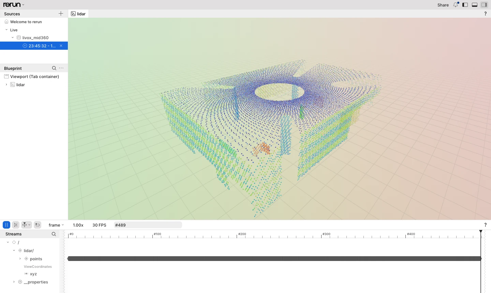

# Getting started

This guide goes from a fresh Ubuntu 24.04 machine to point clouds. First it uses the bundled
LiDAR simulator, so no hardware is needed; then it connects a real Mid-360. The last step
uses the library from your own CMake project. Every command below was run in a clean
Ubuntu 24.04 container, and the sample output comes from those runs.

1. [Install the toolchain](#1-install-the-toolchain)
2. [Build and test](#2-build-and-test)
3. [Receive point clouds from the simulator](#3-receive-point-clouds-from-the-simulator)
4. [Record and replay](#4-record-and-replay)
5. [View the point cloud (optional)](#5-view-the-point-cloud-optional)
6. [Connect a real Mid-360](#6-connect-a-real-mid-360)
7. [Use the library in your project](#7-use-the-library-in-your-project)

## 1. Install the toolchain

```sh
sudo apt update
sudo apt install -y build-essential cmake ninja-build catch2 python3 git
```

Ubuntu 24.04 ships GCC 13 and CMake 3.28, which is enough. GCC 14 (`g++-14`) and Clang 19
(`clang-19`) also work. Clang uses the newest GCC whose `libgcc-N-dev` is installed, and other
packages (`libgccjit0`, for example) can pull in `libgcc-14-dev` alone. Clang then fails with
`cannot find -lstdc++`; install `libstdc++-14-dev` as well. Python 3 is only needed for the
simulator and the tests; the library has no runtime dependency. The full requirements,
including other platforms, are in the [README](../README.md#requirements).

## 2. Build and test

```sh
git clone https://github.com/atinfinity/livox-mid360-core.git
cd livox-mid360-core
cmake -S . -B build -G Ninja -DCMAKE_BUILD_TYPE=Release
cmake --build build
ctest --test-dir build --output-on-failure -j4
```

The summary of the test run should read:

```
100% tests passed, 0 tests failed out of 258
```

Many tests start the Python simulator on `127.0.0.1`. On macOS a few multi-device tests are
skipped, because only `127.0.0.1` is configured on the loopback interface there.

Besides the library, the build contains:

| Path | What it is |
| --- | --- |
| `build/examples/minimal_receive` | Receives frames and IMU samples and prints one line per frame ([examples/README.md](../examples/README.md)) |
| `build/examples/collect_firmware_log` | Saves the LiDAR's own firmware log |
| `build/tools/cli/livox-mid360-cli` | Records to `.lvx2` and replays it ([lvx2.md](lvx2.md)); `list` prints the LiDARs on the network, `info` a LiDAR's serial number and firmware versions |

## 3. Receive point clouds from the simulator

`tools/livox_mid360_sim.py` behaves like a Mid-360 on the wire and uses the same ports. Start
it in one terminal:

```sh
python3 tools/livox_mid360_sim.py --bind 127.0.0.1
```

```
{"event":"ready","ip":"127.0.0.1","ports":{"discovery":56000,"cmd":56100,"push":56200,"pcl":56300,"imu":56400,"log":56500},"sn":"SIM0000000000001","pid":949}
```

In a second terminal, receive for three seconds:

```sh
build/examples/minimal_receive --lidar-ip 127.0.0.1 --host-ip 127.0.0.1 --seconds 3
```

Frames and IMU samples go to stdout:

```
imu t=1790684456272778712 gyro=(0.007,-0.003,0.003) acc=(0.015,-0.011,0.983)
frame 0 points=4992 first=(-13.014,-4.455,-1.884) t=1790684456272724170 dropped=0
frame 1 points=19200 first=(-17.212,-7.751,0.768) t=1790684456299764212 dropped=0
frame 2 points=19200 first=(-1.288,4.721,-0.025) t=1790684456400535254 dropped=0
...
frame 30 points=19200 first=(22.196,36.721,-1.183) t=1790684459201315130 dropped=0
received 31 frames, 721 imu packets
```

Discovery and statistics go to stderr:

```
found SIM0000000000001 at 127.0.0.1:56000
stats packets=2310 points=191520 frames=10 imu=315 bad=0 dropped=0 reordered=0
...
```

How to read it:

- A frame is 100 ms of points: 200 packets of 96 points, 19 200 points. The first one is
  partial, because sampling starts in the middle of a frame.
- `t` is the frame's base time in nanoseconds. Each point's own time is `offset_ns` after it.
- The simulator's points are seeded random positions. They exercise the pipeline but do not
  show a scene.

Stop the simulator with Ctrl-C. What it supports, and what it assumes where the protocol
documentation is silent, is described in [simulator.md](simulator.md).

## 4. Record and replay

With the simulator running again, record three seconds to an `.lvx2` file:

```sh
build/tools/cli/livox-mid360-cli record --out capture.lvx2 \
  --lidar-ip 127.0.0.1 --host-ip 127.0.0.1 --duration 3
```

```
found SIM0000000000001 at 127.0.0.1:56000
packets=2018 frames=20 bytes=2679506
packets=4023 frames=40 bytes=5421986
packets=6035 frames=60 bytes=8164466
wrote capture.lvx2: packets=6035 frames=61 bytes=8275541 imu_ignored=604
```

`record` counts the file's 50 ms frames, and `.lvx2` has no IMU packets, so they are counted
as ignored. Replaying the file needs no
LiDAR. It runs the packets through the same frame assembly as a live `Device`, paced by the
recorded time:

```sh
build/tools/cli/livox-mid360-cli replay capture.lvx2
```

```
device sn=SIM0000000000001 lidar_id=16777343 type=9 extrinsic=on
frame 0 points=19200 t=4322275627 dropped=0
...
frame 30 points=3360 t=7323228920 dropped=0
packets=6035 frames=31 points=579360 dropped=0 loops=1
```

Replay options:

- `--rate 0`: replay as fast as possible.
- `--loop`: repeat until Ctrl-C.
- `--quiet`: print the device and summary lines only, not one line per frame.

The file format and the options are described in [lvx2.md](lvx2.md).

## 5. View the point cloud (optional)

`livox-mid360-rerun` shows a live LiDAR or an `.lvx2` file in the [Rerun](https://rerun.io)
viewer, natively or in a browser:



It is the one part of the repository with a third-party dependency, so it is off by default.
To build it, configure with `-DLIVOX_MID360_BUILD_RERUN=ON`. The first build fetches the Rerun
C++ SDK and builds Apache Arrow, which takes a few minutes. Building, the viewer and the
browser recipe are described in [rerun.md](rerun.md).

## 6. Connect a real Mid-360

> [!NOTE]
> The library is developed and tested against the simulator. Verification on real hardware is
> in progress ([#11](https://github.com/atinfinity/livox-mid360-core/issues/11)). Please
> report anything that behaves differently on your LiDAR.

**Network.** The Mid-360 talks UDP on a fixed IPv4 address in `192.168.1.0/24`. Connect its
Ethernet cable to the host, directly or through a switch. Then give that interface a static
address in the same subnet that no other device uses, for example `192.168.1.5`:

```sh
ip -br link                                   # find the interface name, e.g. enp3s0
sudo ip addr add 192.168.1.5/24 dev enp3s0    # until the next reboot; use netplan to keep it
```

On a desktop, NetworkManager usually has a DHCP profile for the interface. It activates that
profile when the link comes up, which can remove an address added with `ip addr`. Give the
interface its own profile instead:

```sh
nmcli con add type ethernet ifname enp3s0 con-name mid360 connection.autoconnect-priority 10 \
  ipv4.method manual ipv4.addresses 192.168.1.5/24 ipv4.never-default yes ipv6.method disabled
```

**Firewall.** The host receives on these UDP ports:

| Port | Stream |
| --- | --- |
| 56101 | command replies |
| 56201 | status push |
| 56301 | point cloud |
| 56401 | IMU |
| 56501 | firmware log |

With `ufw` enabled, allow UDP from the LiDAR's subnet:

```sh
sudo ufw allow from 192.168.1.0/24 proto udp
```

**Receive.** Without `--lidar-ip`, `minimal_receive` broadcasts a discovery request and uses the
first LiDAR that answers. It prints that LiDAR's serial number and address:

```sh
build/examples/minimal_receive --host-ip 192.168.1.5 --seconds 5
```

```
found <serial number> at <LiDAR address>:56000
```

Once you know the address, pass it as `--lidar-ip`, which also works when several LiDARs share
the network. `Device::open` points the LiDAR's data streams at `--host-ip`, so no setting has to
be changed on the LiDAR beforehand. Ctrl-C stops sampling and exits cleanly.

**List.** `livox-mid360-cli list` broadcasts one discovery request and prints every LiDAR
that answers within `--timeout-ms` (default 1000), one per line. It writes nothing to the
LiDARs. Exit 2 means none answered:

```sh
build/tools/cli/livox-mid360-cli list --host-ip 192.168.1.5
```

```
sn=<serial number> ip=<LiDAR address> cmd_port=56100 dev_type=<n> from=<LiDAR address>:56000
found 1 LiDAR(s)
```

`--lidar-ip` (repeatable) asks the given addresses by unicast instead. A warning on stderr
means that a LiDAR reports an address other than the one it answered from: commands go to
the reported address, so it cannot be opened from this host as it is.

**Identify.** `livox-mid360-cli info` takes the same `--host-ip` / `--lidar-ip` / `--sn` and
prints what discovery reports and the identity keys, including the firmware version
(`version_app`). It only reads, so it also works on a LiDAR you do not want reconfigured:

```sh
build/tools/cli/livox-mid360-cli info --host-ip 192.168.1.5
```

```
discovery: sn=<serial number> ip=<LiDAR address> cmd_port=56100 dev_type=<n> from=<LiDAR address>:56000
identity: sn=<serial number> product_info=<...> version_app=<a.b.c.d> version_loader=<...> version_hardware=<...> mac=<...>
```

**Troubleshooting** by exit code of `minimal_receive`:

| Exit | Message on stderr | Check |
| --- | --- | --- |
| 2 | `discovery: no LiDAR answered` | Link and power, host address in `192.168.1.0/24`, firewall, `--host-ip` naming the right interface |
| 2 | an error from `open` or `start_sampling` | The reason is printed. A timeout usually means that the command replies (56101) are blocked |
| 3 | `received 0 frames` | Point cloud port 56301 is blocked, or `--host-ip` is not the address the LiDAR can reach |

The same flags work for `livox-mid360-cli record`. To record the real LiDAR, use
`--host-ip 192.168.1.5` and, once known, `--lidar-ip`.

## 7. Use the library in your project

**Installed package.** Install into a prefix:

```sh
sudo cmake --install build          # /usr/local
sudo ldconfig                       # so the shared library is found at run time
```

Then use it from your project with `find_package`:

```cmake
cmake_minimum_required(VERSION 3.28)
project(my_app LANGUAGES CXX)
set(CMAKE_CXX_STANDARD 23)
set(CMAKE_CXX_STANDARD_REQUIRED ON)

find_package(livox_mid360_core CONFIG REQUIRED)
add_executable(my_app main.cpp)
target_link_libraries(my_app PRIVATE livox::mid360_core)
```

```cpp
#include <iostream>
#include <livox/mid360/mid360.hpp>

int main()
{
  std::cout << "livox-mid360-core " << livox::mid360::kVersionString << "\n";
}
```

```sh
cmake -S . -B build -G Ninja   # add -DCMAKE_PREFIX_PATH=/your/prefix for another prefix
cmake --build build && build/my_app
```

```
livox-mid360-core 0.1.0
```

The public headers use `std::expected`, so the target requires C++23 and passes that on to
`my_app` through `livox::mid360_core`. Setting the standard in your own project as above keeps
the choice explicit.

**FetchContent.** Build the library as part of your project instead of installing it. There
is no release tag yet, so pin a commit:

```cmake
include(FetchContent)
FetchContent_Declare(livox_mid360_core
  GIT_REPOSITORY https://github.com/atinfinity/livox-mid360-core.git
  GIT_TAG <commit hash>)
FetchContent_MakeAvailable(livox_mid360_core)

target_link_libraries(my_app PRIVATE livox::mid360_core)
```

As a subproject it builds only the library: no tests, examples or tools, and no `-Werror`
([README](../README.md#build)).

## Next steps

- [README: Usage](../README.md#usage): the receive loop in code (`Context` → `discover` →
  `Device::open` → `on_frame` → `start_sampling`). The runnable version is
  `examples/minimal_receive.cpp`.
- [api.md](api.md): the device API, threading rules, events, configuration keys and
  reconnection.
- [architecture.md](architecture.md): how the layers, threads and data flows fit together.
- [simulator.md](simulator.md): driving the simulator from tests (faults, time
  synchronisation, pcap replay).
- [CONTRIBUTING.md](../CONTRIBUTING.md): lint, fuzzing, coverage and reproducing CI locally.
