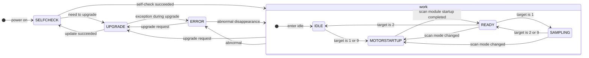

# Protocol notes

Observations, ambiguities and decisions that go beyond the wiki text
("Livox LiDAR Communication Protocol – Mid360", rev v1.4.12, 2026-09-21).
Items marked **[unverified]** must be confirmed against hardware in phase 2 and updated here.

## Data packet header, bytes 12–23

The table defines offset 12, size 12 as `reserved`. The accompanying diagram, and the v1.4.3
changelog ("Add tag_type to the point cloud frame header"), show a `pack_info` field before
`reserved`. Neither the size of `pack_info` nor the encoding of `tag_type` is documented.
The library exposes the 12 bytes verbatim as `DataPacketHeader::reserved` and `decode_tag()`
assumes the single documented tag layout. **[unverified]** Capture real packets and record the
actual contents here.

## Discovery ACK `dev_type`

The wiki does not list the enumeration for `dev_type`. The library keeps it as a raw `uint8_t`.
**[unverified]** Record the value a Mid-360 reports.

## Unaligned fields

`0x0101` ACK has `key_num` at offset 1 and the key-value list at offset 3, so most 16/32-bit
fields are misaligned. All parsing uses `memcpy`-based reads; never cast the buffer to a struct.

## Point cloud CRC coverage

`crc32` at offset 24 covers `timestamp` (offset 28, 8 bytes) followed by `data`. These are
contiguous on the wire, so the CRC is computed over `packet[28 : 28 + 8 + data_len]`.

## Per-point timestamps

`t_i = timestamp + i * time_interval * 100 ns / (dot_num - 1)`. Integer division is used
(truncation, sub-nanosecond). With 96 points and the typical ~103.5 µs interval this is a
~1.09 µs point spacing.

## Command frame CRC32 with empty data

The spec says CRC32 "needs to be padded with 0" when the data length is 0. The library writes
`0` in that case and requires `0` when parsing. (CRC-32 of an empty buffer is also 0, so an
implementation that computes it anyway is compatible.)

## Sequence numbers

`seq_num` is a free-running 32-bit counter per host; ACKs echo it. Wrap-around is not special.
The LiDAR-originated `0x0102` push is a REQ with `sender_type = 1` and, per the sequence
diagram, is not acknowledged by the host. The wiki does not enumerate the keys it carries
[unverified: the simulator pushes every read-only key `0x8000`–`0x8011`; the SDK reads
`cur_work_state` / `hms_code` and keeps the rest as `Device::pushed_status()`, tolerating any
missing key] (#11).

## Working state

The protocol wiki (section 1.2.1.2.2) shows the LiDAR state machine as a figure
([`Mid360_state_machine_english.png`](https://livox-wiki-en.readthedocs.io/en/latest/_images/Mid360_state_machine_english.png))
next to the enumeration table. The figure, redrawn:

| `cur_work_state` | Value | Requestable via `work_tgt_mode` | Meaning (figure) |
|---|---|---|---|
| `SAMPLING` | 1 | yes | scan module and laser on, point cloud and IMU streaming |
| `IDLE` | 2 | yes | laser off (scan module off) |
| `ERROR` | 4 | no | laser off, error reported (HMS) |
| `SELFCHECK` | 5 | no | software / hardware self-check, firmware check |
| `MOTORSTARTUP` | 6 | no | scan module warm-up (if required) and start |
| `UPGRADE` | 8 | via the upgrade entry only | firmware update |
| `READY` | 9 | yes | scan module on, laser off |

Consequences for the SDK:

- `IDLE → SAMPLING` passes through `MOTORSTARTUP` and `READY`; `SAMPLING → IDLE` passes
  through `READY`; `READY ↔ SAMPLING` is direct. `wait_for_state()` polls through the
  intermediate states, so `start_sampling()` from `IDLE` takes at least the motor start-up
  time (unknown, see below).
- `work_tgt_mode` is a stored parameter that the machine chases; `decode_work_state()` accepts
  the seven values above and rejects everything else. `0x07` (`kLivoxLidarMotorStoping` in
  the Livox-SDK2 enum, which is shared with the HAP) is not in the Mid-360 table and is
  rejected too. Key `0x0020` (work mode after boot) exists for the HAP only (Livox-SDK2
  changelog 1.2.5) and is not modelled.
- After a reboot the LiDAR comes back through `SELFCHECK` and `IDLE` and then follows
  `work_tgt_mode`, which is not persisted (default `SAMPLING`).

Settled by the figure: the states, the edges and which targets are requestable. Still
**unverified** ([#11](https://github.com/atinfinity/livox-mid360-core/issues/11)) and
therefore assumptions in the simulator: the duration of `SELFCHECK` and `MOTORSTARTUP` and
whether commands are answered during `SELFCHECK`; whether the pass-through `READY` is ever
visible in the push; the return codes for a `work_tgt_mode` write of 4 / 5 / 6 / 8 (assumed
`0x20`), of an undefined value (assumed `0x03`) and in `ERROR` / `UPGRADE` (assumed `0x02`);
whether a write during `SELFCHECK` / `MOTORSTARTUP` is accepted and followed (assumed yes);
whether `0x07` is ever reported; the persistence of `work_tgt_mode`; and whether a changed
`pattern_mode` really restarts the motor ("scan mode changed" edge).

## Return code 0x21 (PARAM_REBOOT_EFFECT)

Treated as success-with-note by callers: the parameter was stored but needs a reboot
(`lidar_ipcfg` is the obvious case; `Device::set<K>()` reports it as
`SetResult::reboot_required`). **[unverified]** Which keys answer `0x21`, and whether an
unchanged value still does; the simulator answers `0x21` only for a changed `lidar_ipcfg`.

## FOV keys 0x0015 / 0x0016 / 0x0017

`fov_cfg0` / `fov_cfg1` are `int32` yaw start / stop in [0, 360) and pitch start / stop in
(-10, 60), all in degrees, plus a reserved `uint32`; `fov_cfg_en` is a bit mask (bit 0 / bit
1). The library range-checks in `fov_in_range()` (`Device::set_fov()`, `HostSetup::fov`) but
lets equal or reversed start / stop through. **[unverified]** the return code for an
out-of-range value (the simulator answers `0x03`), whether a reversed yaw window wraps around
0°, whether the edges are inclusive, whether both windows combine as a union, and whether a
FOV change needs a reboot (`0x21`) or a motor restart. See #11 and #39.

## HMS table

The wiki lists `0x0210–0x0219` twice (error: "trying to recover"; fatal: "abnormal"). The
level byte in the code distinguishes them; the library carries one description for the range.

## Variants

v1 targets the base Mid-360. `speed_mode` (0x0021) and `pc_freq_mod` (0x0029) exist in the
key table but are not given typed helpers. Spherical output (data type 3) and multicast are
modelled because the base model supports them.
